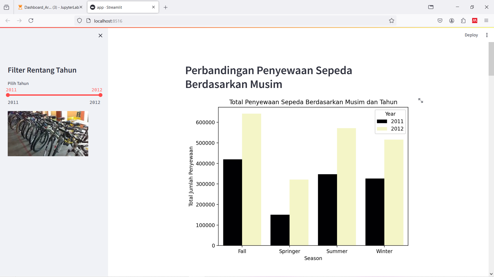
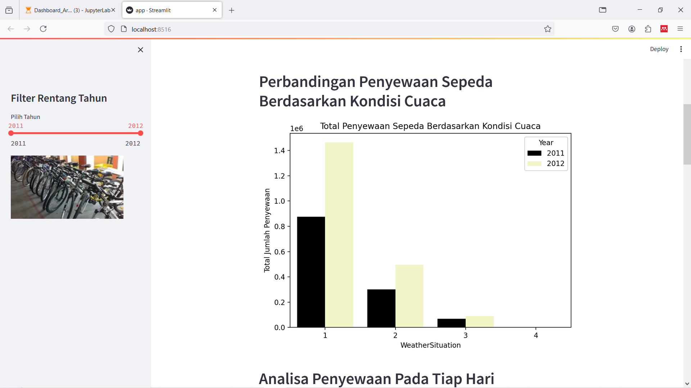
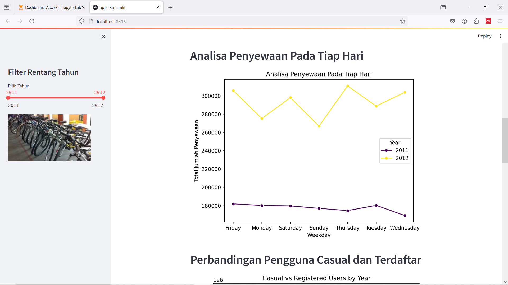
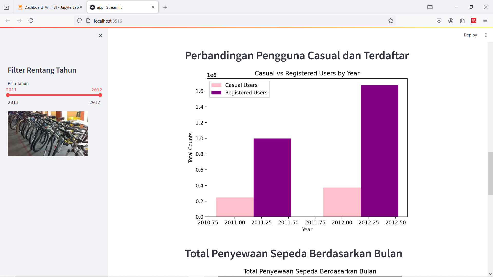
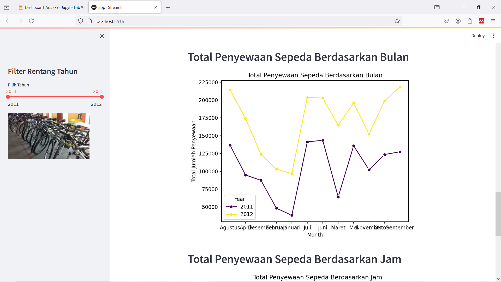
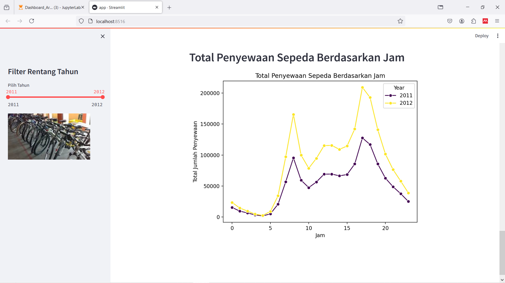

<<<<<<< HEAD
# Dicoding-Bike-Sharing
Penugasan dicoding dengan menggunakan bike sharing dataset
=======
# Bike Sharing Dashboard

## Description

Project ini berisikan proyek Analisis Data pada dataset Bike Sharing. Selanjutnya hasil analisis dibuat dashboard

## Directory

- `/dashboard`: Berisi file  yang ditampilkan untuk dashboard, 1 dataset, dan 1 gambar.
- `/data` : Menyimpan dataset yang digunakan untuk analisis
- `notebook.ipynb` : file jupyter notebook 
- `README.md` : file informasi tentang proyek ini
- `requirements.txt` : Berisikan library apa saja yang dilakukan 
- `Video_Dashboard_Arya.mp4` : Video  yang menampilkan hasil dashboard 

## Run steamlit app
```
streamlit run dashboard.py
```

## Streamlit Cloud 
Link Streamlit Tirta: <a href='https://bikesharing-tirtaaj.streamlit.app/' target='_blank' title='Bike Sharing Dashboard by Tirta Agung Jati | Streamlit'>Bike Sharing Dashboard by Tirta Agung Jati</a>

## Berikut Tampilan atau hasil screenshot dari dashboard







>>>>>>> c8bb0ab (first commit)
